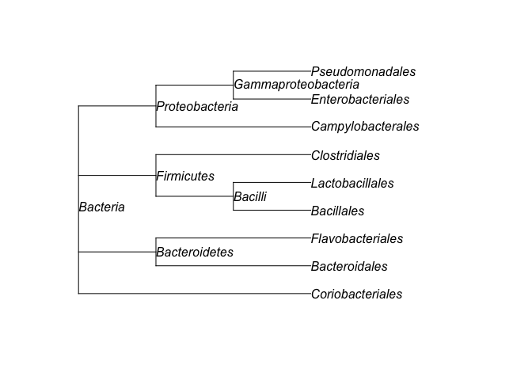

<!-- README.md is generated from README.Rmd. Please edit that file -->

# yatah <a href='https://abichat.github.io/yatah'></a>

<!-- badges: start -->

[](https://www.gnu.org/licenses/gpl-3.0.en.html)
[](https://www.tidyverse.org/lifecycle/#experimental)
[](commits/master)
[](https://travis-ci.org/abichat/yatah)
[](https://codecov.io/gh/abichat/yatah?branch=master)
[](https://www.codacy.com/app/abichat/yatah?utm_source=github.com&utm_medium=referral&utm_content=abichat/yatah&utm_campaign=Badge_Grade)
[](/commits/master)
<!-- [](https://ci.appveyor.com/project/abichat/yatah) -->
<!-- [](https://cran.r-project.org/package=yatah) -->
<!-- badges: end -->

The goal of **yatah** is to manage taxonomy when lineages are described
with strings and ranks separated with special patterns like `|*__` or
`;*__`.

For instance, the well-known *Escherichia coli* could be coded as
`k__Bacteria|p__Proteobacteria|c__Gammaproteobacteria|o__Enterobacteriales|f__Enterobacteriaceae|g__Escherichia|s__Escherichia_coli`.

## Installation

<!-- You can install the released version of yatah from [CRAN](https://CRAN.R-project.org) with: -->

<!-- ``` r -->

<!-- install.packages("yatah") -->

<!-- ``` -->

<!-- And the development version from [GitHub](https://github.com/) with: -->

You can install the development version from
[GitHub](https://github.com/) with:

``` r
# install.packages("devtools")
devtools::install_github("abichat/yatah")
```

## Example

``` r
library(yatah)
```

``` r
lineages <- c(
  "k__Bacteria|p__Actinobacteria|c__Actinobacteria|o__Coriobacteriales",
  "k__Bacteria|p__Bacteroidetes|c__Bacteroidia|o__Bacteroidales",
  "k__Bacteria|p__Bacteroidetes|c__Flavobacteriia|o__Flavobacteriales",
  "k__Bacteria|p__Firmicutes|c__Bacilli|o__Bacillales",
  "k__Bacteria|p__Firmicutes|c__Bacilli|o__Lactobacillales",
  "k__Bacteria|p__Firmicutes|c__Clostridia|o__Clostridiales",
  "k__Bacteria|p__Proteobacteria|c__Epsilonproteobacteria|o__Campylobacterales",
  "k__Bacteria|p__Proteobacteria|c__Gammaproteobacteria|o__Enterobacteriales",
  "k__Bacteria|p__Proteobacteria|c__Gammaproteobacteria|o__Pseudomonadales"
)
```

  - `is_rank()` checks if the lineages are of the desired rank.

<!-- end list -->

``` r
is_rank(lineages, rank = "order")
#> [1] TRUE TRUE TRUE TRUE TRUE TRUE TRUE TRUE TRUE
is_rank(lineages, rank = "species")
#> [1] FALSE FALSE FALSE FALSE FALSE FALSE FALSE FALSE FALSE
```

  - `is_clade()` checks if the lineages belong to the desired clade.

<!-- end list -->

``` r
is_clade(lineages, clade = "Proteobacteria", rank = "phylum")
#> [1] FALSE FALSE FALSE FALSE FALSE FALSE  TRUE  TRUE  TRUE
```

  - `last_clade()` extracts the last clade of the lineages.

<!-- end list -->

``` r
last_clade(lineages)
#> [1] "Coriobacteriales"  "Bacteroidales"     "Flavobacteriales" 
#> [4] "Bacillales"        "Lactobacillales"   "Clostridiales"    
#> [7] "Campylobacterales" "Enterobacteriales" "Pseudomonadales"
```

  - `all_clades` extracts all clades of the lineages.

<!-- end list -->

``` r
all_clades(lineages, simplify = TRUE)
#>  [1] "Actinobacteria"        "Actinobacteria"       
#>  [3] "Bacillales"            "Bacilli"              
#>  [5] "Bacteria"              "Bacteroidales"        
#>  [7] "Bacteroidetes"         "Bacteroidia"          
#>  [9] "Campylobacterales"     "Clostridia"           
#> [11] "Clostridiales"         "Coriobacteriales"     
#> [13] "Enterobacteriales"     "Epsilonproteobacteria"
#> [15] "Firmicutes"            "Flavobacteriales"     
#> [17] "Flavobacteriia"        "Gammaproteobacteria"  
#> [19] "Lactobacillales"       "Proteobacteria"       
#> [21] "Pseudomonadales"
```

  - `taxtable()` computes the taxonomic table corresponding to the
    lineages.

<!-- end list -->

``` r
table <- taxtable(lineages)
table
#>    kingdom         phylum                 class             order
#> 1 Bacteria Actinobacteria        Actinobacteria  Coriobacteriales
#> 2 Bacteria  Bacteroidetes           Bacteroidia     Bacteroidales
#> 3 Bacteria  Bacteroidetes        Flavobacteriia  Flavobacteriales
#> 4 Bacteria     Firmicutes               Bacilli        Bacillales
#> 5 Bacteria     Firmicutes               Bacilli   Lactobacillales
#> 6 Bacteria     Firmicutes            Clostridia     Clostridiales
#> 7 Bacteria Proteobacteria Epsilonproteobacteria Campylobacterales
#> 8 Bacteria Proteobacteria   Gammaproteobacteria Enterobacteriales
#> 9 Bacteria Proteobacteria   Gammaproteobacteria   Pseudomonadales
```

  - `taxtree()` computes the taxonomic tree (format `phylo`) from a
    taxonomic table.

<!-- end list -->

``` r
tree <- taxtree(table)
tree
#> 
#> Phylogenetic tree with 9 tips and 6 internal nodes.
#> 
#> Tip labels:
#>  Coriobacteriales, Bacteroidales, Flavobacteriales, Bacillales, Lactobacillales, Clostridiales, ...
#> Node labels:
#> [1] "Bacteria"            "Bacteroidetes"       "Firmicutes"         
#> [4] "Bacilli"             "Proteobacteria"      "Gammaproteobacteria"
#> 
#> Rooted; includes branch lengths.
plot(tree, show.node.label = TRUE)
```


